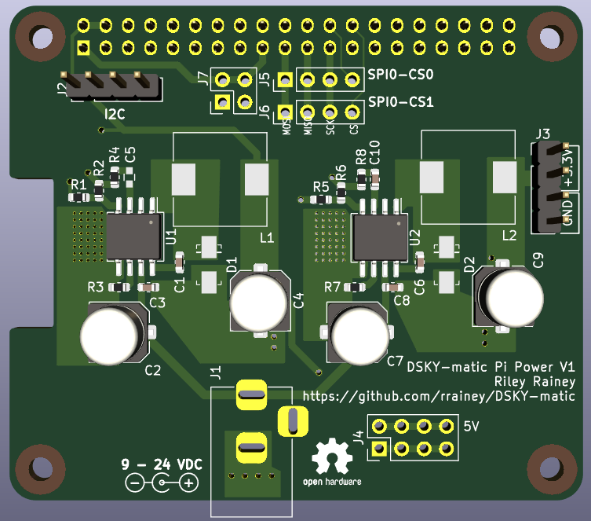

# Pi-Power for DSKY-matic

This is an integrated power supply for the DSKY-matic.  It supplies 5VDC for the
Raspberry Pi, keyboard, and alarm modules. It also supplies either +3.3VDC or +7VDC for the Display module, depending on whether you are using the LED or EL variant of that module.

Takes power from a 9-24VDC power adapter.

PCB based on the original Pi-Power project from Tonymac32.

##A Warning from the original author

Do not stick your fingers into this circuit while it's powering something you care about.  Your fingers have a resistance value, and will change the feedback network regulating the output (R2,4), and/or bridge the compensation circuit (R3,C4) potentially causing a power surge to the board.  Follow typical electrical rules, don't stick your hands into live power supply circuits.
